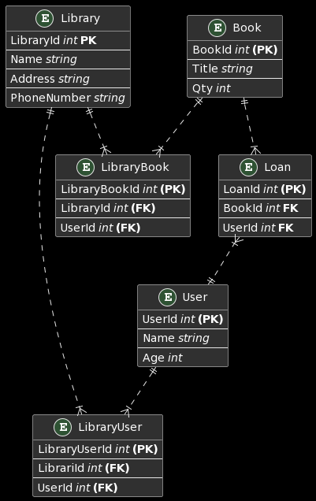

# Database implementation

**Módulo 16** _implementación de base de datos_

> Nota: Estos ejercicios no son necesariamente los propuestos durante el curso.

# :bulb: SQL from scratch...

The idea is to immplement a simple API using Go and MySQL, implementing the __repository__ pattern.

# Project Library

Creata an API for use in libraries.

ERD:

# Tools:

ERD: [PlantUML](https://plantuml.com/)

MySQL shell: [mycli](https://www.mycli.net/)
