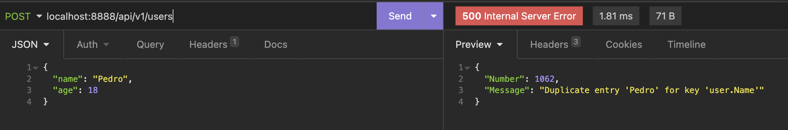

# Database implementation

**Módulo 16** _implementación de base de datos_

> Nota: Estos ejercicios no son necesariamente los propuestos durante el curso.

# :bulb: SQL from scratch...

The idea is to immplement a simple API using Go and MySQL, implementing the __repository__ pattern.

# Project Library

Creata an API for use in libraries.

ERD:


File structure:

```
.
├── cmd
│   └── server
│       ├── handler
│       │   ├── book.go
│       │   ├── library.go
│       │   ├── loan.go
│       │   └── user.go
│       ├── main.go
│       └── routes
│           └── routes.go
├── db
│   ├── db-script.sql
│   └── db.go
├── go.mod
├── go.sum
├── internal
│   ├── book
│   │   ├── repository.go
│   │   └── service.go
│   ├── domain
│   │   ├── book.go
│   │   ├── library.go
│   │   ├── loan.go
│   │   └── user.go
│   ├── library
│   │   ├── repository.go
│   │   └── service.go
│   ├── loan
│   │   ├── repository.go
│   │   └── service.go
│   └── user
│       ├── repository.go
│       ├── repository_test.go
│       └── service.go
└── test
```

# What I've learned so far...

## Validation [controller]

La validación de la solicitud está integrada en **gin-gonic** a través del paquete [**validator**](https://github.com/go-playground/validator). Se colocan las validaciones necesarias directamente en la etiqueta de la estructura:

```go
type User struct {
    Id          int         `json:"id"`
    Name        string      `json:"name" binding:"required, alpha"`
    Age         int         `json:"age" binding:"required, min=18"`
}
```

## Validation [repository]

Si se require que un campo sea único (p. ej. una identificación o código único), no hace falta recorrer la base de datos para ver si ya existe en alguna fila. Usar las restricciones brindadas por **SQL** y la consulta devolverá el error adecuado.

```sql
CREATE TABLE
  IF NOT EXISTS User (
    Id int NOT NULL AUTO_INCREMENT,
    Name varchar(255) NOT NULL UNIQUE,
    Age int,
    PRIMARY KEY (Id)
  );
```



# Tools:

ERD: [PlantUML](https://plantuml.com/)

MySQL shell: [mycli](https://www.mycli.net/)
